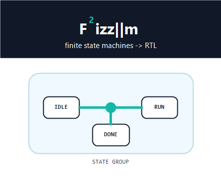

# Fizzim 2.0

Finite State Machine design tool for building readable FSM diagrams and
generating Verilog/SystemVerilog.



## Documentation

The detailed documentation lives in the GitHub wiki:

https://github.com/cookacounty/fizzim/wiki

Start with [Getting Started](https://github.com/cookacounty/fizzim/wiki/Getting-Started)
for build/run instructions, then see
[Modeling Features](https://github.com/cookacounty/fizzim/wiki/Modeling-Features)
for forks, state groups, and transition actions.

The repo keeps only short reference material here. The wiki is the source of
truth for detailed usage, lint, backend testing, and legacy documentation.

## Quick Start

Fizzim builds into a runnable Java jar. For normal use you need a JDK to build
it and a Java runtime to run it. Perl is needed when generating HDL through the
checked-in `fizzim.pl` backend or running the backend tests.

From the repository root:

```sh
make
java -jar fizzim.jar
```

If you are on Windows and do not have GNU Make installed, use the included
batch helper instead:

```bat
make.cmd jar
java -jar fizzim.jar
```

The jar builds with Java 11-compatible bytecode by default, so Java 11 or newer
is recommended.

## Install Prerequisites

### Windows

The easiest Windows setup is:

- Install a JDK, such as Eclipse Temurin 17 or newer.
- Install Perl, such as Strawberry Perl.
- Install Git for Windows if you want Git Bash for shell-based tests.
- Optional: install GNU Make, or just use `make.cmd`.
- Optional: install Node.js if you want to run the fuzz tests.

Using `winget` from PowerShell:

```powershell
winget install EclipseAdoptium.Temurin.17.JDK
winget install StrawberryPerl.StrawberryPerl
winget install Git.Git
winget install OpenJS.NodeJS.LTS
```

After installing, close and reopen PowerShell so `java`, `javac`, `perl`,
`bash`, and `node` are on `PATH`.

Verify the tools:

```powershell
java -version
javac -version
perl -v
bash --version
node --version
```

Build and run:

```bat
make.cmd jar
java -jar fizzim.jar
```

If you installed GNU Make, this also works from PowerShell or Git Bash:

```sh
make
java -jar fizzim.jar
```

### Linux

Install a JDK, Perl, GNU Make, and Bash with your distribution package manager.
Node.js is optional and only needed for fuzz tests.

Debian or Ubuntu:

```sh
sudo apt update
sudo apt install default-jdk perl make bash nodejs npm
```

Fedora:

```sh
sudo dnf install java-latest-openjdk-devel perl make bash nodejs npm
```

Arch Linux:

```sh
sudo pacman -S jdk-openjdk perl make bash nodejs npm
```

Verify the tools:

```sh
java -version
javac -version
perl -v
make --version
bash --version
node --version
```

Build and run:

```sh
make
java -jar fizzim.jar
```

## Common Commands

Build the jar:

```sh
make jar
```

Run the GUI:

```sh
java -jar fizzim.jar
```

Generate HDL directly with the Perl backend:

```sh
perl fizzim.pl -noaddversion testcases/generic_ctrl_fsm.fzm
```

On Windows, the same command can be run from PowerShell if Perl is on `PATH`:

```powershell
perl fizzim.pl -noaddversion testcases\generic_ctrl_fsm.fzm
```

Run the public backend regression tests:

```sh
make test
```

Windows fallback:

```bat
make.cmd test
```

Run the optional Perl-vs-Java backend fuzz comparison:

```sh
make test-fuzz
```

Clean generated build files:

```sh
make clean
```

Windows fallback:

```bat
make.cmd clean
```

If your JDK is not on `PATH`, set `JAVA_HOME` before building:

```sh
JAVA_HOME=/path/to/jdk make jar
```

On Windows:

```bat
set JAVA_HOME=C:\Path\To\JDK
make.cmd jar
```

## Branding

Fizzim 2.0 uses a simplified dark-header splash screen with an integrated `F²`
wordmark, plus a matching `F²` app icon, to reflect the updated GUI and modeling
features.

## Credits

Fizzim was originally written by Michael Zimmer of Zimmer Design Services.
Fizzim 2.0 feature updates were added by Aaron Cook.

Fizzim on the web: http://www.fizzim.com
