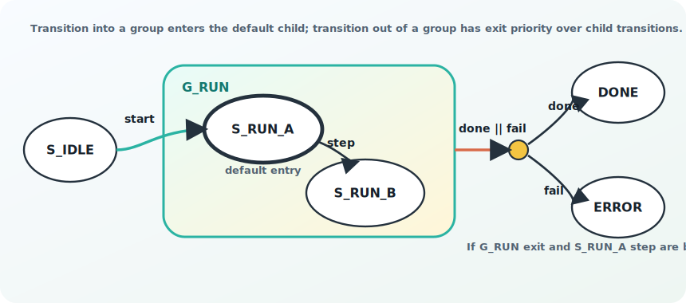

# Fizzim 2.0

Finite State Machine design tool for building readable FSM diagrams and
generating Verilog/SystemVerilog.


## Credits

Fizzim was originally written by Michael Zimmer of Zimmer Design Services.
Fizzim 2.0 feature updates, including forked transitions and state groups, were
added by Aaron Cook.

See [CHANGELOG.md](CHANGELOG.md) for a summary of the Fizzim 2.0 changes.
Future GUI refinement ideas are tracked in
[docs/GUI_WISHLIST.md](docs/GUI_WISHLIST.md).

To compile, run:

```sh
make
```

This creates `fizzim.jar`, which can be run on Linux or Windows with:

```sh
java -jar fizzim.jar
```

The jar is compiled with `--release 11` by default, so it runs on Java 11 or
newer even when you build it with a newer JDK. To target a different runtime:

```sh
make JAVA_RELEASE=17
```

On Windows, run the same commands from Git Bash. If Java is not already on
PATH, pass your JDK location:

```sh
make JAVA_HOME=/c/Users/MEA10713/Downloads/microsoft-jdk-25.0.3-windows-x64/jdk-25.0.3+9
```

If GNU Make is not installed on Windows, this repo also includes a small
`make.cmd` fallback with the same common targets:

```bat
make.cmd jar
make.cmd test
make.cmd clean
```

The Windows fallback also defaults to Java 11 bytecode. To override it:

```bat
set JAVA_RELEASE=17
make.cmd jar
```

To remove generated Java build artifacts:

```sh
make clean
```

To run the public backend regression:

```sh
make test
```

Global attributes
-----------------

Global outputs are split into two user-facing panes:

- `Outputs` are generated as module output ports.
- `Internals` are generated as internal FSM variables and are not emitted in the
  module port list.

Internals are intended for helper state, one-cycle pulses, and intermediate
registered values that are useful inside the FSM but should not become public
module ports. Behind the scenes, Internals are still stored in the existing
outputs list with the `suppress_portlist` user attribute. This keeps older
diagrams and the Perl backend compatible while making the GUI workflow clearer.

The `suppress_portlist` attribute is therefore treated as an implementation
detail. New diagrams should normally use the `Internals` pane instead of typing
that user attribute by hand.

Fonts
-----

Fizzim uses Java's logical `Monospaced` font for diagram text, the global
canvas table, and attribute-editor table cells. This gives fixed-width
alignment for HDL-style names and expressions while remaining portable across
Windows and Linux. Java maps `Monospaced` to an available platform font such as
Consolas, DejaVu Sans Mono, Liberation Mono, or another installed monospace
font.

The rest of the GUI continues to use the normal platform look-and-feel fonts.

Fizzim on the web: www.fizzim.com

Verilog backend
---------------

The Verilog/SystemVerilog backend is `fizzim.pl`. By default, simulation
state-name debug output reserves 256 ASCII characters:

```verilog
`ifndef SYNTHESIS
reg [2047:0] statename;
...
`endif
```

The width can be overridden with `-statenamechars <value>`, but the default is
intentionally large because this debug register is not synthesized.

Backend regression scripts live under `testcases/`:

Use `make test` from Linux or Windows Git Bash. The test runner uses `xrun`
when available, otherwise it falls back to Icarus Verilog and Yosys from OSS
CAD Suite when its `bin/` directory is on PATH or `OSS_CAD_SUITE` points at the
suite directory. It also uses `node` to generate the old-style compatibility
diagram.

The test flow starts from one feature-rich generic diagram, generates a Fizzim
1.0-compatible golden diagram from it, then regenerates Verilog from both
diagrams before compiling or simulating. See `testcases/README.md` for the
layout and the `FIZZIM1_BACKEND` override if you want to compare against an
actual old backend.

The `testcases/generic_state_machine_lint_issues.fzm` diagram is a separate
GUI/lint showcase. It intentionally contains common mistakes so `Tools > Lint
Diagram` has visible examples to select and highlight. It is not part of the
golden backend equivalence regression.

Forked transitions
------------------

Forks let one transition condition feed several branch conditions. This avoids
duplicating the common part of an expression on every outgoing transition.


Without a fork, a state like `START` may need repeated logic:

```verilog
START: begin
  if (rdy && error)
    nextstate = ERROR;
  else if (rdy && !error)
    nextstate = FINISHED;
end
```

With a fork, `rdy` is written once on the transition into the fork. The branch
transitions only describe how to choose the final destination:

```verilog
START: begin
  if (rdy) begin
    if (error)
      nextstate = ERROR;
    else
      nextstate = FINISHED;
  end
end
```

In the GUI, a fork is drawn as a small filled dot. It is a transition endpoint,
not an encoded state.

Fork priority rules:

- The transition into the fork controls where the expanded forked transitions
  sit relative to other transitions leaving the original source state.
- Outgoing fork branches are then sorted by their own priority. Lower numeric
  priority values are tested first.
- If a branch equation is `1`, it is treated as the default/fallback branch and
  is tested after conditional branches with the same priority.
- If the incoming transition has a priority, generated branches keep that
  priority with a tiny ordering offset so the branch order is stable without
  moving the whole fork above or below unrelated transitions.
- If the incoming transition has no priority, the outgoing branch priority is
  used directly.

For example, this fork:

```text
START -- rdy, priority 20 --> FORK_RESULT
FORK_RESULT -- error, priority 0 --> ERROR
FORK_RESULT -- 1, priority 1 --> FINISHED
```

behaves like:

```verilog
START: begin
  if ((rdy) && (error))
    nextstate = ERROR;
  else if (rdy)
    nextstate = FINISHED;
end
```

The backend combines fork equations with logical AND. Empty equations are
ignored, so an unconditional branch from a fork uses only the incoming
condition.

State groups
------------

State groups let several existing states share a transition or shared state
behavior. The group is drawn as a rounded rectangle around the member states.
Only one level of grouping is supported.


For example, two states can share the same shutdown transition:

```verilog
RDY: begin
  if (shutdown_req)
    nextstate = SHUTDOWN;
end

FUSE_RDY: begin
  if (shutdown_req)
    nextstate = SHUTDOWN;
end
```

With a state group, the common transition is authored once on the group and is
expanded for each member state during generation:

```verilog
RDY: begin
  if (shutdown_req)
    nextstate = SHUTDOWN;
end

FUSE_RDY: begin
  if (shutdown_req)
    nextstate = SHUTDOWN;
end
```

State groups are also used for simulation debug naming. When a state is inside
a group, `statename` should include both names:

```verilog
`ifndef SYNTHESIS
reg [2047:0] statename; // 256 characters
always @* begin
  case (state)
    RDY:
      statename = "READY_GROUP.RDY";
    FUSE_RDY:
      statename = "READY_GROUP.FUSE_RDY";
    default:
      statename = "XXXXXXXXXXXXXXXXXXXXXXXXXXXXXXXXXXXXXXXXXXXXXXXXXXXXXXXXXXXXXXXXXXXXXXXXXXXXXXXXXXXXXXXXXXXXXXXXXXXXXXXXXXXXXXXXXXXXXXXXXXXXXXXXXXXXXXXXXXXXXXXXXXXXXXXXXXXXXXXXXXXXXXXXXXXXXXXXXXXXXXXXXXXXXXXXXXXXXXXXXXXXXXXXXXXXXXXXXXXXXXXXXXXXXXXXXXXXXXXXXXXXXXXXXXXXXXXX";
  endcase
end
`endif
```

The state group itself is not an encoded state. The generated FSM still uses
the original member states, so synthesis-visible behavior should match the
ungrouped machine.

State group behavior and priority
---------------------------------



A state group is a diagram and code-generation convenience, not a real encoded
state. It has three important behaviors:

- Shared state outputs are inherited by child states only when the child state
  leaves that output blank. A child state's explicit value wins over the group
  value.
- A transition out of a state group is expanded into one transition from each
  child state.
- A transition into a state group must enter a real child state. The group
  property editor has a `Default entry` dropdown for this. Older diagrams that
  do not store a default entry fall back to the first child state found in the
  group. In the diagram, the default entry child is drawn with a bold state
  outline so incoming group transitions have an obvious landing state.

Group exit transitions intentionally have higher priority than transitions
authored directly inside a child state. This means a group can define a common
escape condition that always exits the group, even if a child state's local
transition is also true in the same cycle.

For example:

```text
G_RUN contains S_RUN_A and S_RUN_B
G_RUN default entry = S_RUN_A

S_IDLE  -- start --> G_RUN
G_RUN   -- abort --> S_ERROR
S_RUN_A -- step  --> S_RUN_B
```

generates behavior equivalent to:

```verilog
S_IDLE: begin
  if (start)
    nextstate = S_RUN_A; // default entry for G_RUN
end

S_RUN_A: begin
  if (abort)
    nextstate = S_ERROR; // group exit wins
  else if (step)
    nextstate = S_RUN_B;
end

S_RUN_B: begin
  if (abort)
    nextstate = S_ERROR;
end
```

When a state group transition feeds a fork, both rules still apply: the group
transition is expanded to each child state first, then each expanded transition
is fork-expanded. The resulting transitions stay ahead of child-authored
transitions from the same state, and the fork's outgoing branch priorities
decide the order among the generated branch destinations:

```text
G_RUN -- done || fail, priority 5 --> FORK_RESULT
FORK_RESULT -- fail, priority 0 --> S_ERROR
FORK_RESULT -- done, priority 1 --> S_DONE
S_RUN_A -- step, priority 0 --> S_RUN_B
```

behaves like:

```verilog
S_RUN_A: begin
  if (((done || fail)) && (fail))
    nextstate = S_ERROR;
  else if (((done || fail)) && (done))
    nextstate = S_DONE;
  else if (step)
    nextstate = S_RUN_B;
end
```

So the mental model is:

1. Resolve state-group entry destinations.
2. Expand state-group exits to each child state.
3. Expand forks by combining incoming and outgoing equations.
4. Sort transitions from each real state: state-group exits first, then lower
   numeric priority first, then unconditional `1` fallbacks, then transition
   name for deterministic output.
