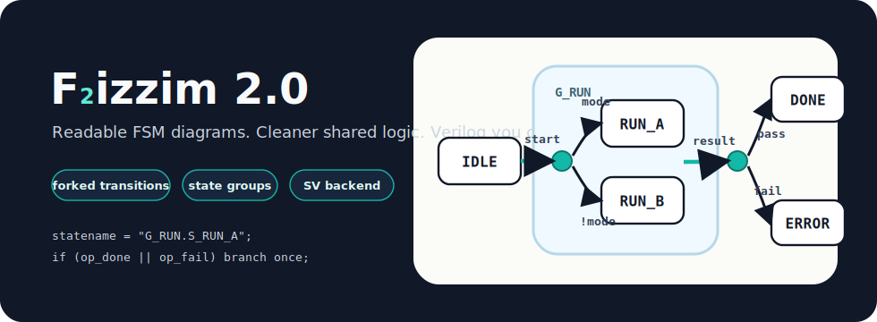
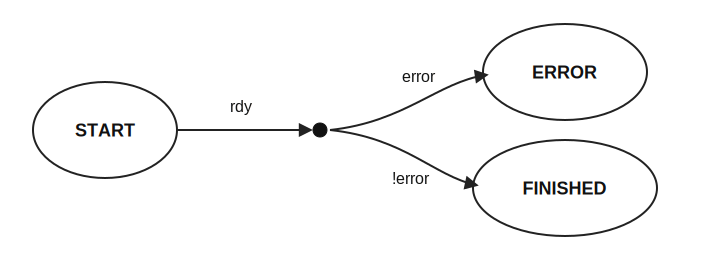
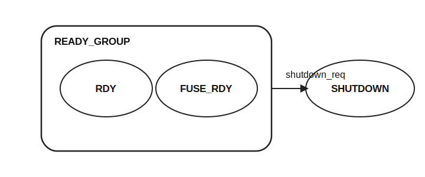

# Fizzim 2.0

Finite State Machine design tool for building readable FSM diagrams and
generating Verilog/SystemVerilog.



## Credits

Fizzim was originally written by Michael Zimmer of Zimmer Design Services.
Fizzim 2.0 feature updates, including forked transitions and state groups, were
added by Aaron Cook.

To compile, run:

```sh
make
```

This creates `fizzim.jar`, which can be run on Linux or Windows with:

```sh
java -jar fizzim.jar
```

On Windows, run the same commands from Git Bash. If Java is not already on
PATH, pass your JDK location:

```sh
make JAVA_HOME=/c/Users/MEA10713/Downloads/microsoft-jdk-25.0.3-windows-x64/jdk-25.0.3+9
```

If GNU Make is not installed on Windows, this repo also includes a small
`make.cmd` fallback with the same common targets:

```bat
make.cmd jar
make.cmd test
make.cmd clean
```

To remove generated Java build artifacts:

```sh
make clean
```

To run the public backend regression:

```sh
make test
```

Fizzim on the web: www.fizzim.com

Verilog backend
---------------

The Verilog/SystemVerilog backend is `fizzim.pl`. By default, simulation
state-name debug output reserves 256 ASCII characters:

```verilog
`ifndef SYNTHESIS
reg [2047:0] statename;
...
`endif
```

The width can be overridden with `-statenamechars <value>`, but the default is
intentionally large because this debug register is not synthesized.

Backend regression scripts live under `testcases/`:

Use `make test` from Linux or Windows Git Bash. The test runner uses `xrun`
when available, otherwise it falls back to Icarus Verilog and Yosys from OSS
CAD Suite when its `bin/` directory is on PATH or `OSS_CAD_SUITE` points at the
suite directory.

The test flow regenerates Verilog from `.fzm` files using the repo-local
`fizzim.pl` before compiling or simulating, so stale generated RTL cannot hide
backend regressions. See `testcases/README.md` for the public testcase layout,
including the golden machine and the equivalent fork/state-group machine. Local
or sensitive machines should live outside `testcases/`; this repo ignores
`testcases_production/` for that purpose.

Forked transitions
------------------

Forks let one transition condition feed several branch conditions. This avoids
duplicating the common part of an expression on every outgoing transition.



Without a fork, a state like `START` may need repeated logic:

```verilog
START: begin
  if (rdy && error)
    nextstate = ERROR;
  else if (rdy && !error)
    nextstate = FINISHED;
end
```

With a fork, `rdy` is written once on the transition into the fork. The branch
transitions only describe how to choose the final destination:

```verilog
START: begin
  if (rdy) begin
    if (error)
      nextstate = ERROR;
    else
      nextstate = FINISHED;
  end
end
```

In the GUI, a fork is drawn as a small filled dot. It is a transition endpoint,
not an encoded state.

State groups
------------

State groups let several existing states share a transition or shared state
behavior. The group is drawn as a rounded rectangle around the member states.
Only one level of grouping is supported.



For example, two states can share the same shutdown transition:

```verilog
RDY: begin
  if (shutdown_req)
    nextstate = SHUTDOWN;
end

FUSE_RDY: begin
  if (shutdown_req)
    nextstate = SHUTDOWN;
end
```

With a state group, the common transition is authored once on the group and is
expanded for each member state during generation:

```verilog
RDY: begin
  if (shutdown_req)
    nextstate = SHUTDOWN;
end

FUSE_RDY: begin
  if (shutdown_req)
    nextstate = SHUTDOWN;
end
```

State groups are also used for simulation debug naming. When a state is inside
a group, `statename` should include both names:

```verilog
`ifndef SYNTHESIS
reg [2047:0] statename; // 256 characters
always @* begin
  case (state)
    RDY:
      statename = "READY_GROUP.RDY";
    FUSE_RDY:
      statename = "READY_GROUP.FUSE_RDY";
    default:
      statename = "XXXXXXXXXXXXXXXXXXXXXXXXXXXXXXXXXXXXXXXXXXXXXXXXXXXXXXXXXXXXXXXXXXXXXXXXXXXXXXXXXXXXXXXXXXXXXXXXXXXXXXXXXXXXXXXXXXXXXXXXXXXXXXXXXXXXXXXXXXXXXXXXXXXXXXXXXXXXXXXXXXXXXXXXXXXXXXXXXXXXXXXXXXXXXXXXXXXXXXXXXXXXXXXXXXXXXXXXXXXXXXXXXXXXXXXXXXXXXXXXXXXXXXXXXXXXXXXX";
  endcase
end
`endif
```

The state group itself is not an encoded state. The generated FSM still uses
the original member states, so synthesis-visible behavior should match the
ungrouped machine.
